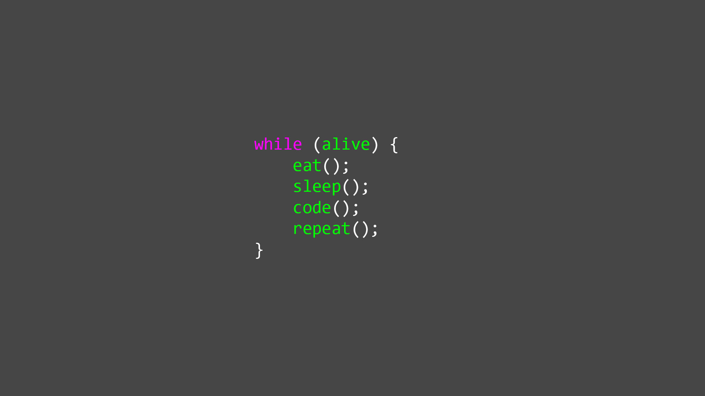

# Comparison
Uses knowledge from Wikipedia to compare two buzzwords using keywords 

# Motivation
"What is better?" is a fundamental and frequently asked question in our everyday live. We compare nearly everything from computer and smartphones to cities and even forms of energy generation.
Unfortunately, there often is no simple answer to this question, because it always depends on certain criterias, that could be done better or worse.
I created Comparison in order to enhance the process of comparing two things - so that you don't have to read through the whole wikipedia-pages of two things you want to compare.

# How does it work?
This web app makes use of Wikipedia's Rest-API to parse the content of wiki-pages. You also don't have to enter the exact wiki-page name for that, "Comparison" will search and redirect automatically. To get the information needed, it searches infoboxes, tables and the plain text of an enntry for keywords and returns the found text to the client.


# Make it run
In order to run it on your computer you simply need to run the appServer.js file via node on your terminal.
Command in terminal (node.js has to be installed and you have to be in the folder containing "appServer.js"):
```
node appServer.js
```

After that, open up a browser and type in "localhost:3000". Congrats, you can now start comparing! :)

# Examples

